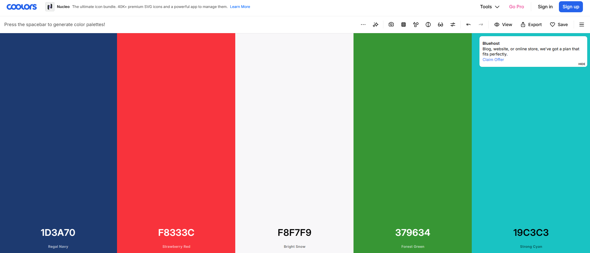
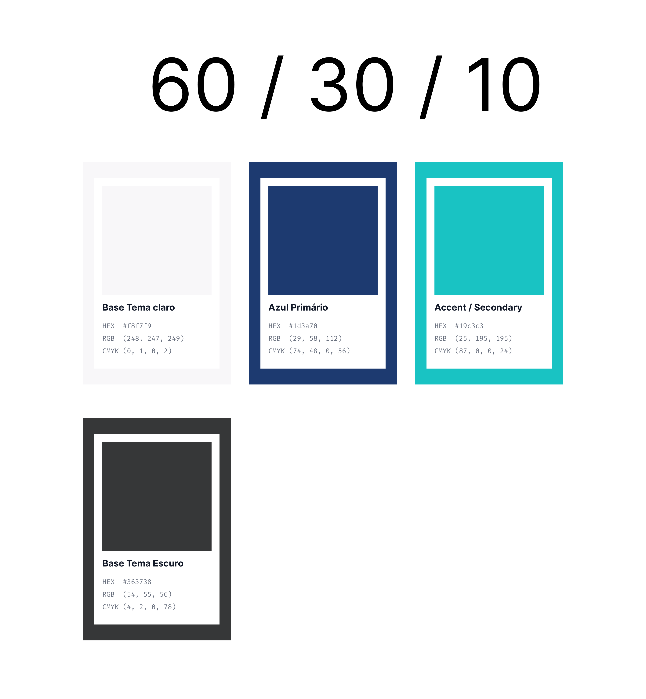
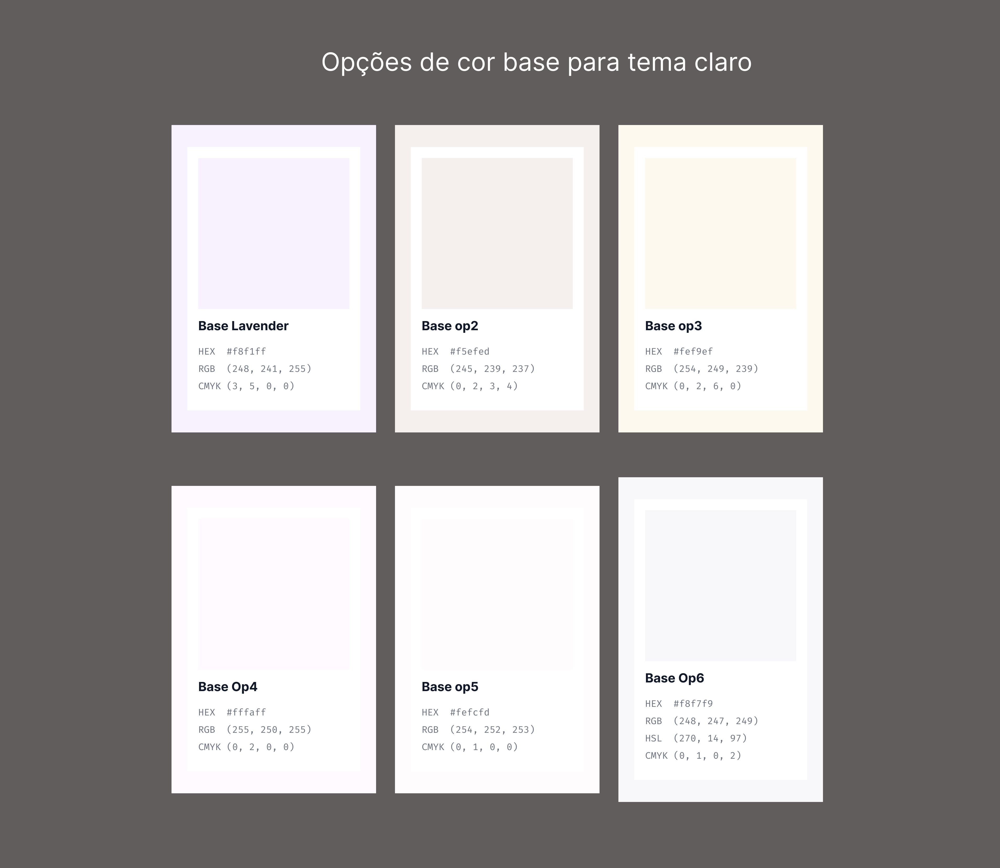
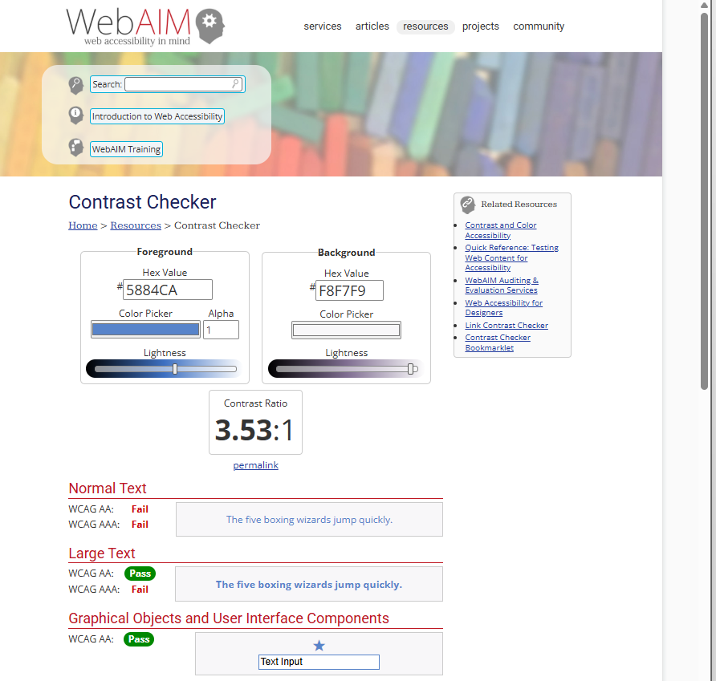
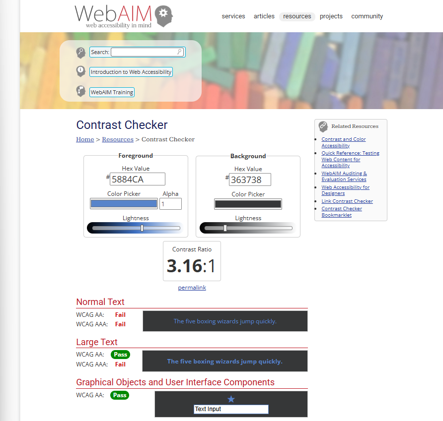
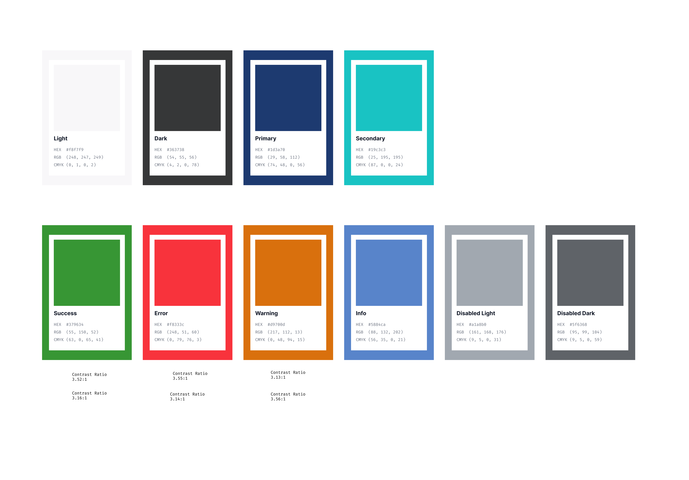

# Definindo as cores do Design System em 4 horas!

## Contexto: caos controlado

Tudo começou como sempre: acumulo absurdo de atividades para entregar e apenas um fim de semana para tentar dar conta.

Entao vamos por partes, porque para montar as cores de um design system em 4 horas, na verdade nos passamos horas debatendo tudo, desde o conceito que iriamos usar como logo ate problemas do tipo:

> "O professor de mobile e Daltonico e as cores que escolhemos nao vao funcionar!"

Mas vamos definir algumas coisas basicas aqui.

Primeiro de tudo, o design system (DS) e um produto que vai servir para outro produto, no caso, o App Guardiao. Ou seja, esse DS precisa funcionar e ser util.

E estamos na jornada de usar esse DS no app, mas para isso e preciso definir uma serie de coisas que compoem o nosso DS, como cor, tipografia, icones, animacoes e tantas outras coisas que em uma empresa seria costumam ficar a cargo do UX design.

Existem diversas formas de comecar, e assim comecamos escolhendo as cores.

E que comece o caos!

---

## Escolhendo as cores

Sim, a nossa logo e um lindo duotone (ou seja, usamos duas cores).

E na pratica, no mundo digital, com telas emitindo uma quantidade absurda de luz, e bem dificil fazer uma boa mescla entre elas.

Entao o que foi feito?

Ja que gostamos das cores, uma solucao e usar uma das cores do duotone como cor primaria e outra como secundaria (ou cor de acento).

Simplificando as coisas, utilizamos a regra dos 60/30/10 (saiba mais aqui: <https://www.alura.com.br/artigos/regra-60-30-10-ui-design>) e usamos 60% para as cores de fundo do tema claro e do tema escuro.

Na verdade, primeiro selecionamos a cor clara a partir das duas cores que ja tinhamos idealizado na logo do app para gerar algumas opcoes de cores claras e, com a cor clara definida, seguimos para a cor escura.

Todo esse processo de definir as cores primaria e secundaria e depois gerar a cor clara foi feito com o site <https://coolors.co/?home>, que gera algumas paletas de cores.

### Imagem 1 - Geracao de cores a partir de cores primarias

As cores definidas no Coolors podem ser travadas com cadeado para manter tons fixos enquanto novas variacoes sao geradas.

Link da paleta usada: <https://coolors.co/1d3a70-f8333c-f5f3f5-379634-19c3c3>

---

## Documentando no Figma

Para documentar tudo isso, la no Figma tem uma pagina que foi criada. Usando o plugin Color Card da para ter uma ideia inicial, pelo menos das principais cores do app.

### Imagem 2 - Hierarquia das cores

### Imagem 3 - Escolha da cor para o tema claro

Mas nao existe app no mundo que se sustente apenas com 3 cores.

---

## Cores semanticas e acessibilidade

No design se usam bastante cores semanticas para indicar algumas informacoes basicas passadas visualmente pelo sistema para o usuario:

- sucesso
- erro
- avisos
- informacoes

E mais cores significam mais problemas de contraste e, principalmente, de acessibilidade.

Para escolher cada uma das cores semanticas, alem de voltar ao <https://coolors.co/?home>, agora e preciso usar mais duas ferramentas voltadas para teste de contraste e acessibilidade:

- WebAIM Contrast Checker  
  <https://webaim.org/resources/contrastchecker/>

- Adobe Color Contrast Analyzer  
  <https://color.adobe.com/create/color-contrast-analyzer>

Cada uma das cores so foi escolhida depois de passar nos testes de contraste de objetos graficos e componentes da interface do usuario.

### Imagem 4 - Testes de acessibilidade por contraste

Ferramenta utilizada: <https://webaim.org/resources/contrastchecker/>

Com isso, finalmente chegamos a paleta de cores basicas.

### Imagem 5 - Paleta de cores final

---

## Tokens semanticos

E dela podemos finalmente destrinchar tokens semanticos, que sao muito uteis na criacao de biblioteca de codigo.

Basicamente, tokens semanticos sao informacoes de como um determinado elemento e usado num DS ou numa biblioteca de codigos.

Por exemplo, ao inves de ficar colocando a cor azul para um botao e uma cor branca como texto dentro do botao, podemos simplesmente referenciar `primary` para a cor e `onPrimary` para qualquer coisa que vai ficar acima da cor primaria, como um texto ou um icone.